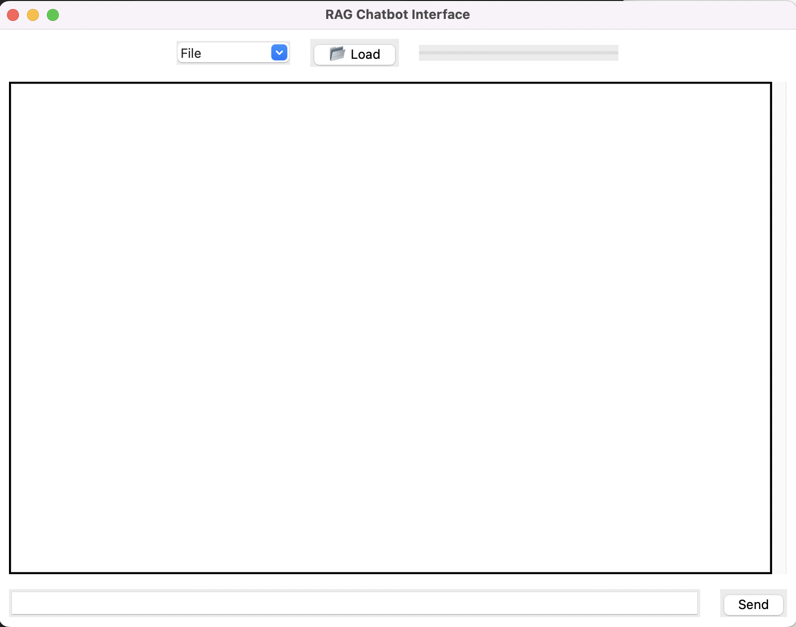

# RAG Model 
-----------

## The goals:
-------------

1. Choose a knowledge base on which to
base your conversational agent

2. Index your knowledge base using an
embedding model of your choice

3. Implement a retrieval step with the user
query and your indexed knowledge base

4. Implement the generation step with the
LLM of your choice

5. Add a conversational interface to your
RAG architecture

6. Find a way to evaluate your
conversational agent in terms of retrieval
and genration performance and
environmental impact

## Installation
```python
pip install -r requirements.txt
```

## Our Approach:
----------------

We implemented RAG, which is an efficient method for enabling LLM models to generate responses based on external data. We implemented it in two parts. A backend containing all the functionality, and a frontend for the interface.

The backend consists of:
- Data loading (ingestion.py)
- Vectorization of the vector database (retrieval.py)
- Database search and augmented response with an LLM (retrieval.py)
- API implementation to connect to the frontend (api.py)

The frontend consists of:
- Graphical interface design (interface.py)
- App launch (main.py)

# Interface 

